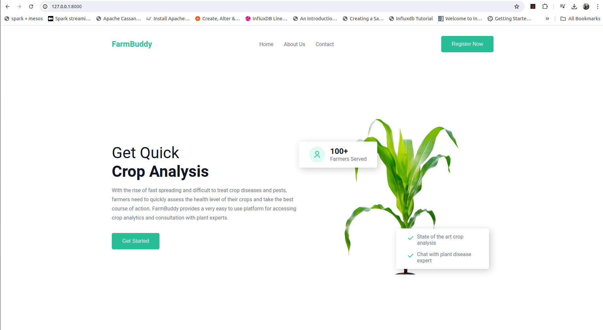
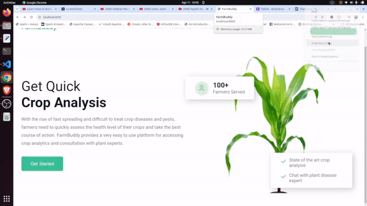

# FarmBuddy
## Overview

 > A web application that uses AI to analyze crops for pests and diseases then advises framers on what to do. 

 ## Application Demo

The application supports the following operations:

1. Account registration using your Google account.
2. Analyzing images for either pests or diseases
3. Chatting with an expert.

  

